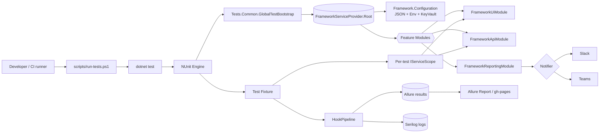
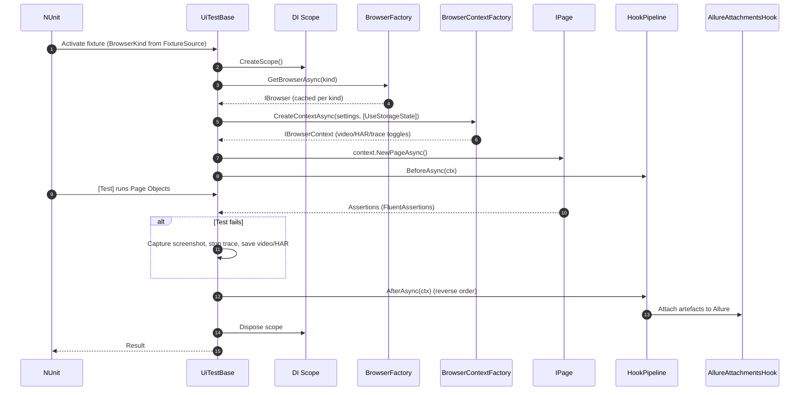
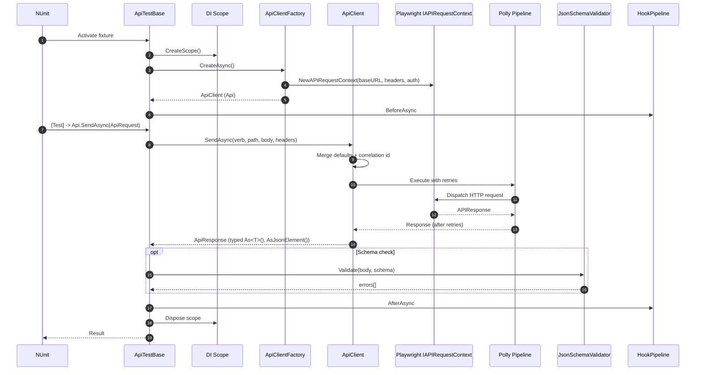
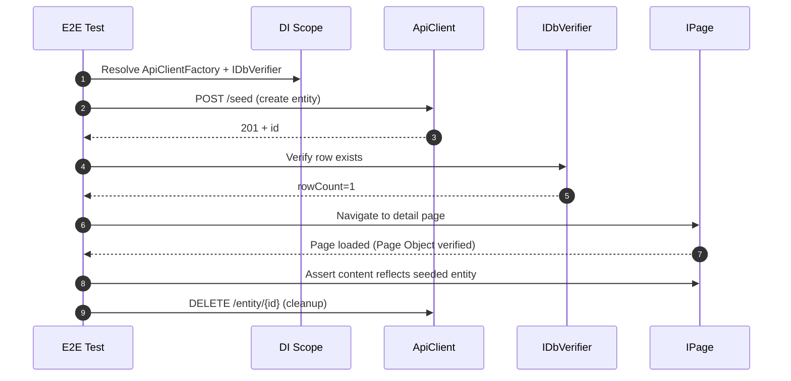
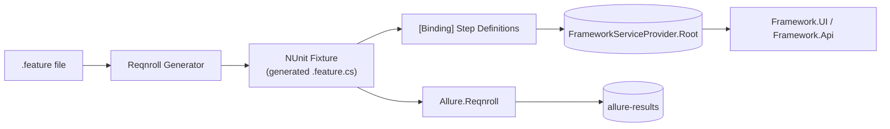
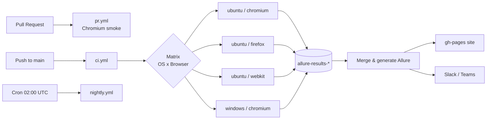

# PlaywrightWithDotnet  

Enterprise-grade test automation framework for **UI + API + E2E** testing built on **Playwright .NET 8**, **NUnit**, and **Reqnroll (BDD)**. Designed for scale: parallel multi-browser execution, dependency injection, layered configuration, Azure Key Vault secrets, Allure reporting, Docker, and dual CI (GitHub Actions + Azure DevOps).

> **Sample target:** [https://gauravkhurana.com/practise-api/](https://gauravkhurana.com/practise-api/) (API) and [https://gauravkhurana.com/practise-api/ui/index.html#/scenarios](https://gauravkhurana.com/practise-api/ui/index.html#/scenarios) (UI).

---

## Highlights

- **Hybrid stack** — UI, API, BDD, and full E2E flows share one DI container, config, and reporting pipeline.
- **Multi-browser parallel execution** — Chromium, Firefox, WebKit, Edge, Chrome via NUnit `[TestFixtureSource]`.
- **Mobile emulation** — built-in iPhone 13, Pixel 7, iPad Pro 11 profiles; extensible.
- **Layered configuration** — `appsettings.json` + `appsettings.{env}.json` + env vars (`PWFX_*`) + Azure Key Vault.
- **Storage state reuse** — log in once, reuse across tests via `[UseStorageState("role")]`.
- **Failure artefacts** — auto-captured trace, video, screenshot, HAR; auto-attached to Allure.
- **Visual regression** — pixel-diff baselines per browser; `UpdateBaselines` mode for refresh.
- **Accessibility** — Axe-core scans with severity threshold gates.
- **Performance smoke** — Web Vitals (LCP/CLS/TTFB) with thresholds.
- **Database validation** — Dapper-based `IDbVerifier` for SQL Server + PostgreSQL.
- **Test data** — Bogus + fluent builders.
- **Reporting** — Allure NUnit & Reqnroll integration with history.
- **Notifications** — Slack & Teams webhook end-of-run summaries.
- **Resilience** — Polly-based retries on the API client; NUnit `[Retry]` for tests.
- **Observability** — Serilog structured logging (console + rolling file).
- **CI ready** — GitHub Actions (PR, CI, nightly) + Azure DevOps templates.
- **Containerised** — Dockerfile + docker-compose with bundled Allure service.
- **Documented** — extensive guides under [docs/](docs).

## Flow Diagrams

The diagrams below render natively on GitHub (Mermaid). They illustrate how a test moves through the framework — from CLI/CI invocation, through DI bootstrap and hooks, into either the UI or API pipeline, and back out as Allure artefacts.

### High-level architecture



### UI test flow



### API test flow



### E2E (UI + API) journey



### BDD scenario flow



### Configuration loading order

```mermaid
flowchart TB
    A[appsettings.json] --> B[appsettings.&#123;TEST_ENV&#125;.json]
    B --> C[appsettings.Local.json<br/><i>gitignored</i>]
    C --> D["Env vars PWFX_* (__ separator)"]
    D --> E{KeyVault.Enabled?}
    E -- yes --> F[Azure Key Vault<br/>DefaultAzureCredential]
    E -- no --> G[Bind to FrameworkSettings]
    F --> G
    G --> H[(Singleton in DI)]
```



### CI pipeline (GitHub Actions matrix)



## Quickstart

```powershell
# 1. Restore & build
dotnet build PlaywrightWithDotnet.slnx -c Release

# 2. Install Playwright browsers (first time only)
pwsh ./scripts/install-browsers.ps1

# 3. Run smoke tests
pwsh ./scripts/run-tests.ps1 -Suite All -Category Smoke -Environment qa -Browsers Chromium

# 4. View Allure report (requires Allure CLI)
pwsh ./scripts/allure-serve.ps1
```

## Solution Layout

```
src/
  Framework.Configuration/  layered config + Key Vault loader, strongly-typed settings
  Framework.Core/           DI, hooks, TestBase, shared Playwright singleton, logging
  Framework.UI/             Browser/Context factories, Page/Component base, visual, a11y, perf
  Framework.Api/            Typed API client, schema validation, Polly retries
  Framework.Data/           Bogus, Builder pattern, Dapper DB verifier
  Framework.Reporting/      Allure attachments, Slack/Teams notifiers
  Framework.Utilities/      Path/JSON/Polly helpers
tests/
  Tests.Common/             shared bootstrap (registers framework modules)
  Tests.UI/                 UI page-object tests parameterised by browser
  Tests.Api/                pure API tests
  Tests.E2E/                hybrid UI+API journeys
  Tests.Bdd/                Reqnroll feature files + step definitions
docker/                     Dockerfile + docker-compose + entrypoint
ci/azure-pipelines/         ADO templates
.github/workflows/          GitHub Actions (ci/pr/nightly)
docs/                       Documentation site (DocFX-ready)
scripts/                    PowerShell helpers
```

## Configuration

Settings are layered in this precedence (last wins):

1. `appsettings.json`
2. `appsettings.{TEST_ENV}.json`
3. `appsettings.Local.json` (developer machine, gitignored)
4. Environment variables prefixed `PWFX_` — use `__` as the section separator. Example:
   ```bash
   PWFX_Framework__Browser__Enabled__0=Firefox
   PWFX_Framework__Ui__Headless=false
   ```
5. Azure Key Vault — set `Framework:KeyVault:Enabled=true` and `Framework:KeyVault:VaultUri=https://....vault.azure.net/`. Authentication uses `DefaultAzureCredential`.

See [docs/configuration.md](docs/configuration.md) for the complete reference.

## Running

| Action | Command |
| --- | --- |
| Smoke (chromium) | `pwsh scripts/run-tests.ps1 -Category Smoke -Browsers Chromium` |
| Multi-browser regression | `pwsh scripts/run-tests.ps1 -Category All -Browsers Chromium,Firefox,Webkit` |
| BDD only | `pwsh scripts/run-tests.ps1 -Suite Bdd` |
| Docker | `docker compose -f docker/docker-compose.yml up --build tests` |
| Allure UI in container | `docker compose -f docker/docker-compose.yml up allure` (then http://localhost:5252) |

## CI

- **GitHub Actions** workflows live under [.github/workflows](.github/workflows): `ci.yml` (matrix), `pr.yml` (smoke), `nightly.yml` (full).
- **Azure DevOps** entry-point [azure-pipelines.yml](azure-pipelines.yml) plus reusable template [ci/azure-pipelines/templates/test-job.yml](ci/azure-pipelines/templates/test-job.yml).

## Contributing

See [CONTRIBUTING.md](CONTRIBUTING.md) and the docs site for design conventions and adding new test types.

## License

MIT — see [LICENSE](LICENSE).
